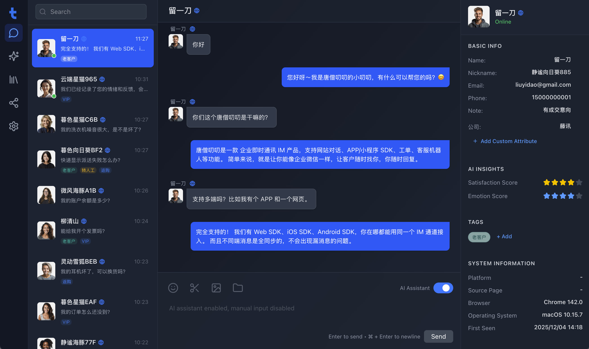
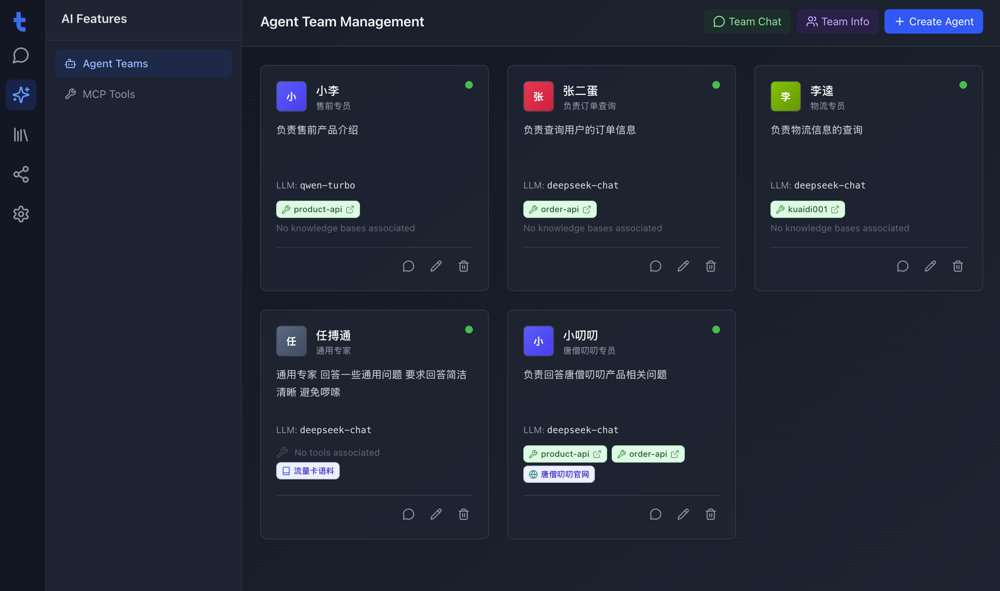
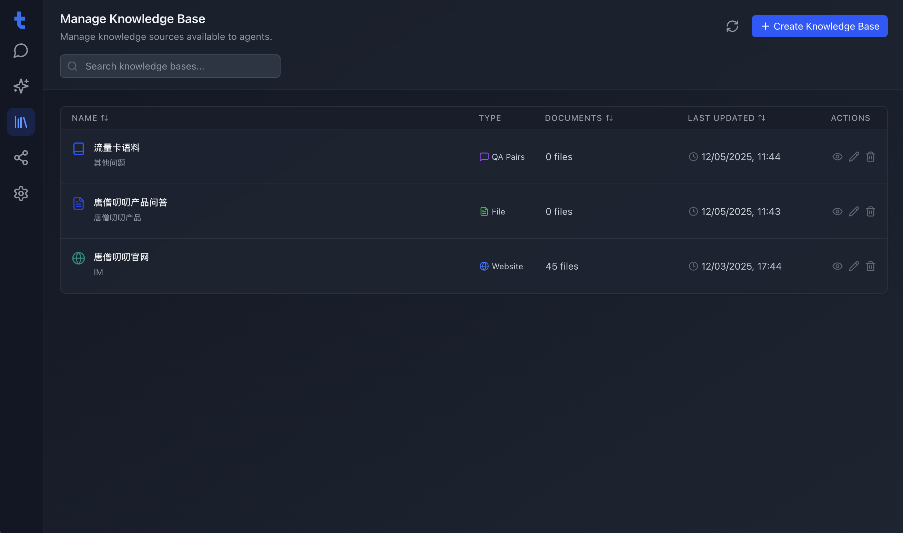
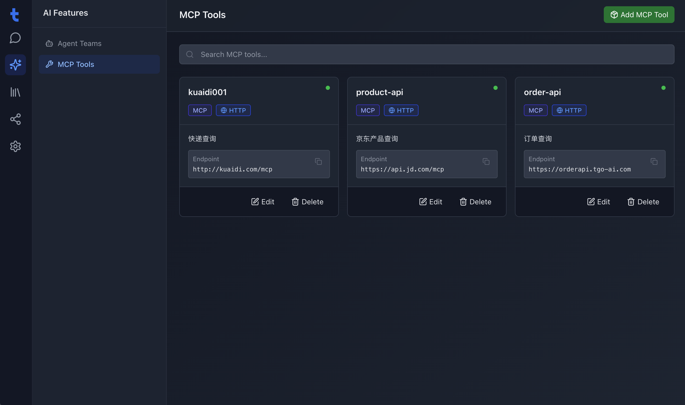
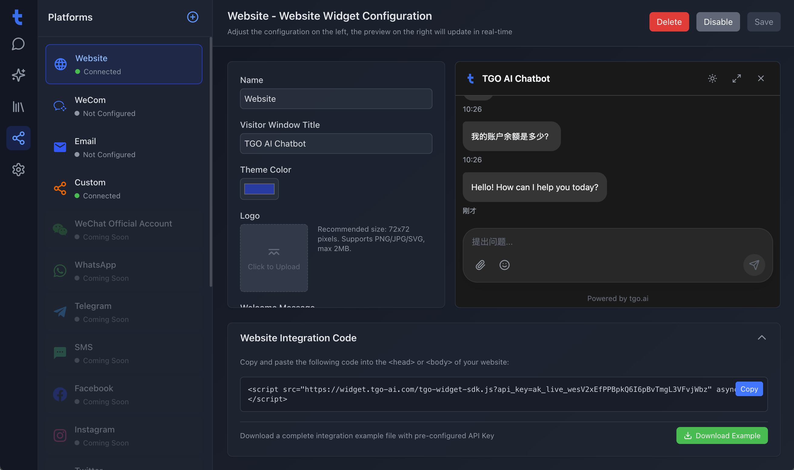

<p align="center">
  
</p>

<p align="center">
  <a href="./README.md">English</a> | <a href="./README_CN.md">简体中文</a> | <a href="./README_TC.md">繁體中文</a> | <a href="./README_JP.md">日本語</a> | <a href="./README_RU.md">Русский</a>
</p>

<p align="center">
  <a href="https://tgo.ai">Website</a> | <a href="https://docs.tgo.ai">Documentation</a>
</p>

# TGO Deploy Guide

This repository provides a Docker Compose-based one-click deployment solution to help you quickly set up the TGO AI Agent Platform.

## Product Preview

| | |
|:---:|:---:|
| **Dashboard** <br>  | **Agent Orchestration** <br>  |
| **Knowledge Base** <br>  | **Q&A Debugging** <br>  |
| **MCP Tools** <br>  | **Platform Admin** <br>  |

## 🚀 Quick Start

### System Requirements
- **CPU**: >= 2 Core
- **RAM**: >= 4 GiB
- **OS**: macOS / Linux / WSL2

### One-Click Deployment

Run the following command on your server to check requirements, clone the repository, and start the services:

```bash
REF=latest curl -fsSL https://raw.githubusercontent.com/tgoai/tgo/main/bootstrap.sh | bash
```

---

For more details, please visit the [Documentation](https://docs.tgo.ai).
