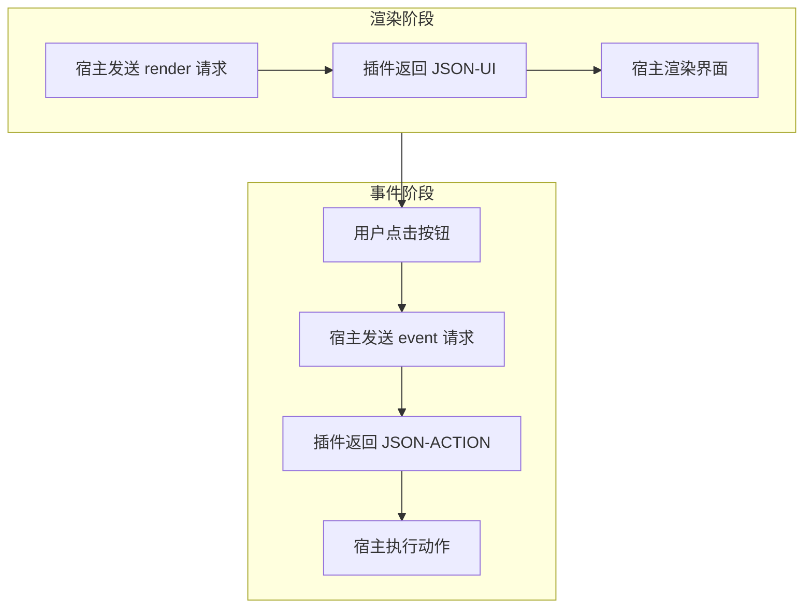
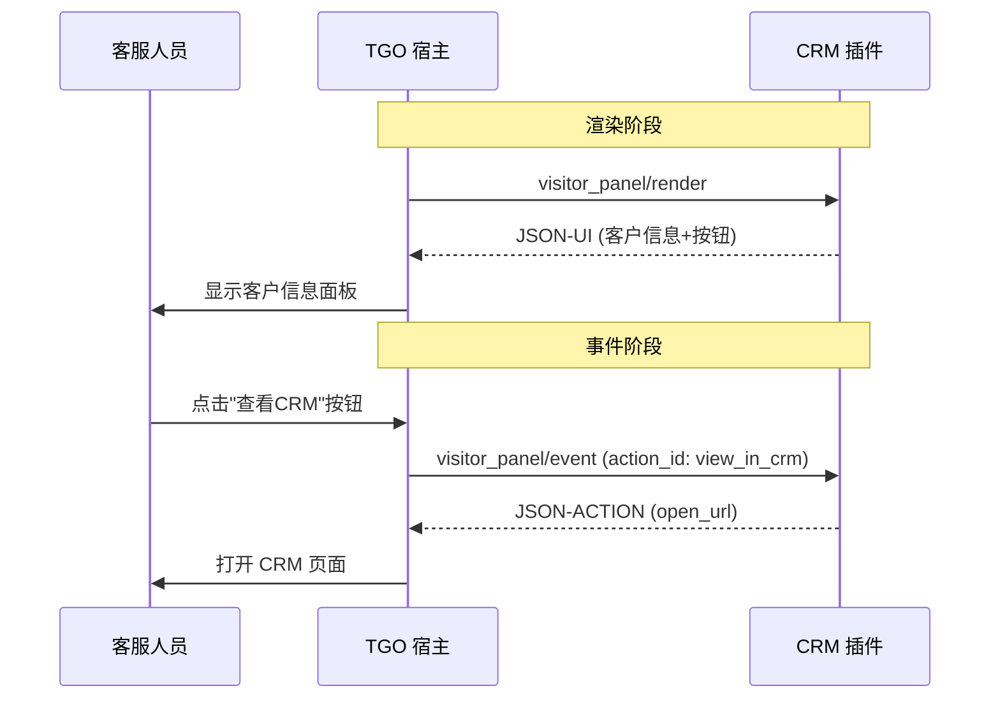
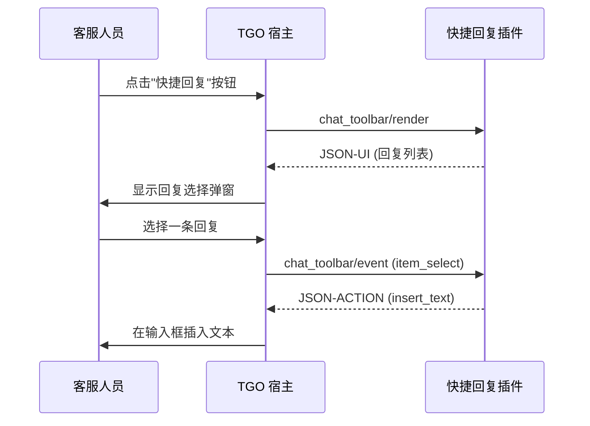

# 可插点详解

TGO 提供四个可插点，允许插件在不同位置扩展客服系统功能。本文档详细介绍每个可插点的使用场景、输入输出和实现方式。

## 交互模式

所有可插点都遵循统一的「**渲染-事件**」交互模式：



| 方法 | 触发时机 | 返回类型 | 说明 |
|------|----------|----------|------|
| `*/render` | 界面需要渲染时 | JSON-UI | 描述 UI 结构 |
| `*/event` | 用户交互时 | JSON-ACTION | 指示执行的操作 |

---

## 访客面板（visitor_panel）

### 概述

在聊天界面右侧的访客信息面板中添加自定义内容块。适用于展示与访客相关的业务数据，如订单信息、CRM 数据、会员等级等。

```
┌─────────────────────────────────────────────────────────┐
│  聊天界面                                                │
│ ┌───────────────────────┐ ┌─────────────────────────┐  │
│ │                       │ │  访客面板                │  │
│ │     聊天消息区域       │ │  ┌───────────────────┐  │  │
│ │                       │ │  │ 基本信息          │  │  │
│ │                       │ │  ├───────────────────┤  │  │
│ │                       │ │  │ 🔌 插件内容块 1   │  │  │
│ │                       │ │  ├───────────────────┤  │  │
│ │                       │ │  │ 🔌 插件内容块 2   │  │  │
│ │                       │ │  └───────────────────┘  │  │
│ └───────────────────────┘ └─────────────────────────┘  │
└─────────────────────────────────────────────────────────┘
```

### 能力声明

```json
{
  "type": "visitor_panel",
  "title": "客户订单",
  "icon": "shopping-cart",
  "priority": 10,
  "refresh_on": ["session_change", "manual"]
}
```

| 字段 | 说明 |
|------|------|
| `title` | 面板块标题 |
| `icon` | 图标（Lucide 图标名） |
| `priority` | 排序优先级（数字越小越靠前） |
| `refresh_on` | 刷新触发条件 |

### 请求参数

```json
{
  "method": "visitor_panel/render",
  "params": {
    "visitor_id": "v_abc123",
    "session_id": "s_xyz789",
    "visitor": {
      "name": "张三",
      "email": "zhangsan@example.com",
      "phone": "138****1234",
      "avatar": "https://...",
      "first_seen_at": "2024-01-15T10:30:00Z",
      "last_seen_at": "2024-12-27T14:20:00Z",
      "metadata": {
        "user_id": "u_12345",
        "vip_level": 3,
        "tags": ["vip", "enterprise"]
      }
    },
    "context": {
      "current_page": "https://example.com/products/123",
      "referrer": "https://google.com",
      "device": "desktop",
      "browser": "Chrome",
      "location": {
        "country": "CN",
        "city": "上海"
      }
    }
  }
}
```

### 响应格式

插件返回 JSON 模版数据，由宿主渲染 UI：

```json
{
  "result": {
    "template": "key_value",
    "data": {
      "title": "会员信息",
      "items": [
        {"label": "会员等级", "value": "黄金会员", "icon": "crown"},
        {"label": "累计消费", "value": "¥12,580.00"},
        {"label": "积分余额", "value": "3,200 分"}
      ]
    }
  }
}
```

### 事件处理

当用户点击 JSON-UI 中的按钮时，宿主发送事件请求：

**请求（visitor_panel/event）：**

```json
{
  "method": "visitor_panel/event",
  "params": {
    "event_type": "button_click",
    "action_id": "view_in_crm",
    "visitor_id": "v_abc123",
    "session_id": "s_xyz789",
    "payload": {}
  }
}
```

**响应（JSON-ACTION）：**

```json
{
  "result": {
    "action": "open_url",
    "data": {
      "url": "https://crm.example.com/customers/v_abc123",
      "target": "_blank"
    }
  }
}
```

### 使用场景

| 场景 | 模版类型 | 说明 |
|------|----------|------|
| 显示 CRM 客户信息 | `key_value` | 展示客户档案 |
| 展示历史订单 | `table` | 表格展示订单列表 |
| 显示会员卡片 | `card` | 卡片式展示会员信息 |
| 跳转外部系统 | `link` | 提供跳转链接 |

### 完整交互流程示例



---

## 聊天工具栏（chat_toolbar）

### 概述

在输入框上方的工具栏添加自定义按钮。点击按钮时触发插件动作，可用于快捷回复、知识库查询、AI 辅助等功能。

```
┌─────────────────────────────────────┐
│           聊天消息区域              │
├─────────────────────────────────────┤
│ [📎] [😊] [📷] [🔌插件1] [🔌插件2]  │  ← 工具栏
├─────────────────────────────────────┤
│ 输入框...                           │
└─────────────────────────────────────┘
```

### 能力声明

```json
{
  "type": "chat_toolbar",
  "title": "快捷回复",
  "icon": "zap",
  "tooltip": "选择快捷回复模板",
  "shortcut": "Ctrl+Shift+R"
}
```

| 字段 | 说明 |
|------|------|
| `title` | 按钮标题 |
| `icon` | 按钮图标 |
| `tooltip` | 鼠标悬停提示 |
| `shortcut` | 快捷键 |

### 渲染请求

当用户点击工具栏按钮时，宿主发送渲染请求：

**请求（chat_toolbar/render）：**

```json
{
  "method": "chat_toolbar/render",
  "params": {
    "action_id": "quick_reply",
    "session_id": "s_xyz789",
    "visitor_id": "v_abc123",
    "agent_id": "a_agent01",
    "context": {
      "last_messages": [
        {
          "role": "visitor",
          "content": "请问发货时间是多久？",
          "timestamp": "2024-12-27T14:25:00Z"
        }
      ],
      "input_text": ""
    }
  }
}
```

**响应（JSON-UI）：**

```json
{
  "result": {
    "template": "list",
    "data": {
      "title": "快捷回复",
      "searchable": true,
      "items": [
        {"id": "r1", "text": "感谢您的咨询，请问有什么可以帮您？"},
        {"id": "r2", "text": "订单一般3-5个工作日发货"},
        {"id": "r3", "text": "如有问题可随时联系我们"}
      ]
    }
  }
}
```

### 事件处理

当用户在渲染的 UI 中进行操作时，宿主发送事件请求：

**请求（chat_toolbar/event）：**

```json
{
  "method": "chat_toolbar/event",
  "params": {
    "event_type": "item_select",
    "action_id": "quick_reply",
    "selected_id": "r2",
    "session_id": "s_xyz789",
    "visitor_id": "v_abc123"
  }
}
```

**响应（JSON-ACTION）：**

```json
{
  "result": {
    "action": "insert_text",
    "data": {
      "text": "订单一般3-5个工作日发货",
      "replace": false
    }
  }
}
```

### 常用 ACTION 类型

#### insert_text

在输入框插入文本：

```json
{
  "action": "insert_text",
  "data": {
    "text": "您好，订单一般3-5个工作日发货。",
    "replace": false
  }
}
```

#### send_message

直接发送消息给访客：

```json
{
  "action": "send_message",
  "data": {
    "content": "感谢您的咨询！",
    "content_type": "text"
  }
}
```

#### open_url

打开外部链接：

```json
{
  "action": "open_url",
  "data": {
    "url": "https://crm.example.com/customers/12345",
    "target": "_blank"
  }
}
```

### 表单交互示例

当需要显示表单时，先返回表单 JSON-UI：

**响应（JSON-UI - 表单）：**

```json
{
  "result": {
    "template": "form",
    "data": {
      "title": "创建工单",
      "fields": [
        {"name": "title", "label": "工单标题", "type": "text", "required": true},
        {"name": "priority", "label": "优先级", "type": "select", "options": [
          {"value": "low", "label": "低"},
          {"value": "medium", "label": "中"},
          {"value": "high", "label": "高"}
        ]},
        {"name": "description", "label": "描述", "type": "textarea"}
      ]
    }
  }
}
```

当用户提交表单后，宿主发送事件：

**请求（chat_toolbar/event - 表单提交）：**

```json
{
  "method": "chat_toolbar/event",
  "params": {
    "event_type": "form_submit",
    "action_id": "create_ticket",
    "form_data": {
      "title": "发货问题",
      "priority": "high",
      "description": "客户反馈..."
    },
    "session_id": "s_xyz789"
  }
}
```

**响应（JSON-ACTION）：**

```json
{
  "result": {
    "action": "show_toast",
    "data": {
      "message": "工单创建成功！工单号: TK-12345",
      "type": "success"
    }
  }
}
```

### 完整交互流程示例



---

## iframe 应用（sidebar_iframe）

### 概述

在聊天界面最右侧添加独立的 iframe 应用。适用于集成复杂的第三方系统，如 CRM、工单系统、数据看板等。

```
┌─────────────────────────────────────────────────────────────────┐
│  聊天界面                                                        │
│ ┌──────────────────┐ ┌────────────┐ ┌────────────────────────┐  │
│ │                  │ │            │ │                        │  │
│ │    聊天消息       │ │  访客面板   │ │   🔌 iframe 应用       │  │
│ │                  │ │            │ │   (CRM / 工单 / ...)   │  │
│ │                  │ │            │ │                        │  │
│ └──────────────────┘ └────────────┘ └────────────────────────┘  │
│                                      [📊][📋][⚙️] ← 应用图标栏   │
└─────────────────────────────────────────────────────────────────┘
```

### 能力声明

```json
{
  "type": "sidebar_iframe",
  "title": "CRM 系统",
  "icon": "users",
  "url": "https://your-crm.example.com/tgo-embed",
  "width": 400,
  "min_width": 300,
  "max_width": 600,
  "allow_fullscreen": true
}
```

### 初始化配置

宿主请求 iframe 配置：

```json
{
  "method": "sidebar_iframe/config"
}
```

响应：

```json
{
  "result": {
    "url": "https://your-app.example.com/tgo-plugin",
    "title": "CRM 系统",
    "icon": "users",
    "width": 400,
    "allow_fullscreen": true,
    "sandbox": "allow-scripts allow-same-origin allow-forms",
    "permissions": ["clipboard-read", "clipboard-write"]
  }
}
```

### iframe 通讯

iframe 内的应用通过 `postMessage` 与宿主通讯：

#### iframe 向宿主发送消息

```javascript
// 在 iframe 内
window.parent.postMessage({
  type: 'tgo_plugin_message',
  action: 'insert_text',
  data: {
    text: '从 CRM 插入的内容'
  }
}, '*');
```

#### 宿主向 iframe 发送消息

```javascript
// 宿主会自动发送上下文信息
{
  type: 'tgo_context_update',
  data: {
    visitor_id: 'v_abc123',
    session_id: 's_xyz789',
    visitor: { ... },
    agent: { ... }
  }
}
```

#### 完整的 iframe 应用示例

```html
<!DOCTYPE html>
<html>
<head>
  <title>CRM 插件</title>
  <script>
    let currentContext = null;

    // 监听来自宿主的消息
    window.addEventListener('message', (event) => {
      const { type, data } = event.data;
      
      if (type === 'tgo_context_update') {
        currentContext = data;
        updateUI(data);
      }
    });

    function updateUI(context) {
      document.getElementById('visitor-name').textContent = 
        context.visitor?.name || '未知访客';
    }

    // 向输入框插入文本
    function insertText(text) {
      window.parent.postMessage({
        type: 'tgo_plugin_message',
        action: 'insert_text',
        data: { text }
      }, '*');
    }

    // 发送消息给访客
    function sendMessage(content) {
      window.parent.postMessage({
        type: 'tgo_plugin_message',
        action: 'send_message',
        data: { content, content_type: 'text' }
      }, '*');
    }
  </script>
</head>
<body>
  <h1>CRM 信息</h1>
  <p>当前访客: <span id="visitor-name">-</span></p>
  <button onclick="insertText('您好！')">快捷回复</button>
</body>
</html>
```

---

## 第三方平台接入（channel_integration）

### 概述

扩展新的消息接入渠道。适用于对接企业自有 IM 系统、行业特定平台等。

### 能力声明

```json
{
  "type": "channel_integration",
  "channel_type": "custom_im",
  "name": "自定义IM平台",
  "icon": "message-circle"
}
```

### 配置清单

宿主请求平台配置：

```json
{
  "method": "channel_integration/manifest"
}
```

响应：

```json
{
  "result": {
    "channel_type": "custom_im",
    "name": "自定义IM平台",
    "icon": "message-circle",
    "description": "接入自定义IM平台，实现消息双向同步",
    
    "config_schema": {
      "type": "object",
      "properties": {
        "api_endpoint": {
          "type": "string",
          "title": "API 地址",
          "description": "平台 API 接口地址",
          "placeholder": "https://api.example.com"
        },
        "api_key": {
          "type": "string",
          "title": "API Key",
          "description": "平台 API 密钥",
          "format": "password"
        },
        "enable_webhook": {
          "type": "boolean",
          "title": "启用 Webhook",
          "default": true
        }
      },
      "required": ["api_endpoint", "api_key"]
    },
    
    "setup_guide": "# 接入指南\n\n## 步骤一：获取 API 密钥\n\n1. 登录平台后台\n2. 进入「开发者设置」\n3. 创建新的 API 密钥\n\n## 步骤二：配置 Webhook\n\n将以下地址配置为消息回调地址：\n\n```\nhttps://your-tgo-domain.com/api/webhooks/custom-im\n```\n\n## 步骤三：测试连接\n\n保存配置后，点击「测试连接」验证配置是否正确。",
    
    "webhook_endpoint": "/api/webhooks/custom-im",
    
    "capabilities": {
      "send_text": true,
      "send_image": true,
      "send_file": true,
      "send_rich_card": false,
      "receive_text": true,
      "receive_image": true,
      "receive_file": true,
      "typing_indicator": true,
      "read_receipt": false
    }
  }
}
```

### 配置表单 Schema

使用 JSON Schema 定义配置表单：

```json
{
  "config_schema": {
    "type": "object",
    "properties": {
      "api_key": {
        "type": "string",
        "title": "API Key",
        "format": "password"
      },
      "region": {
        "type": "string",
        "title": "服务区域",
        "enum": ["cn-north", "cn-south", "ap-southeast"],
        "enumNames": ["华北", "华南", "东南亚"]
      },
      "features": {
        "type": "array",
        "title": "启用功能",
        "items": {
          "type": "string",
          "enum": ["auto_reply", "typing_indicator", "read_receipt"]
        },
        "uniqueItems": true
      }
    }
  }
}
```

### 消息处理

#### 接收消息（Webhook）

外部平台通过 Webhook 发送消息到 TGO：

```json
POST /api/webhooks/custom-im
Content-Type: application/json

{
  "event": "message",
  "timestamp": 1703664000000,
  "from": {
    "id": "external_user_123",
    "name": "访客姓名",
    "avatar": "https://..."
  },
  "message": {
    "id": "msg_abc123",
    "type": "text",
    "content": "你好，请问..."
  }
}
```

#### 发送消息

TGO 通过插件发送消息到外部平台：

```json
{
  "method": "channel_integration/send_message",
  "params": {
    "channel_id": "ch_xyz789",
    "to": {
      "id": "external_user_123"
    },
    "message": {
      "type": "text",
      "content": "您好，感谢咨询..."
    }
  }
}
```

响应：

```json
{
  "result": {
    "success": true,
    "message_id": "external_msg_456"
  }
}
```

---

## 图标参考

TGO 使用 [Lucide](https://lucide.dev/icons/) 图标库，常用图标：

| 图标名 | 用途 |
|--------|------|
| `shopping-cart` | 订单/购物 |
| `users` | 客户/CRM |
| `message-circle` | 消息/聊天 |
| `zap` | 快捷操作 |
| `file-text` | 文档/工单 |
| `settings` | 设置 |
| `search` | 搜索 |
| `star` | 收藏/VIP |
| `tag` | 标签 |
| `clock` | 时间/历史 |

## 下一步

- [模版规范](/plugin/templates) - 学习 JSON 模版格式
- [完整示例](/plugin/examples) - 查看各可插点的完整实现

