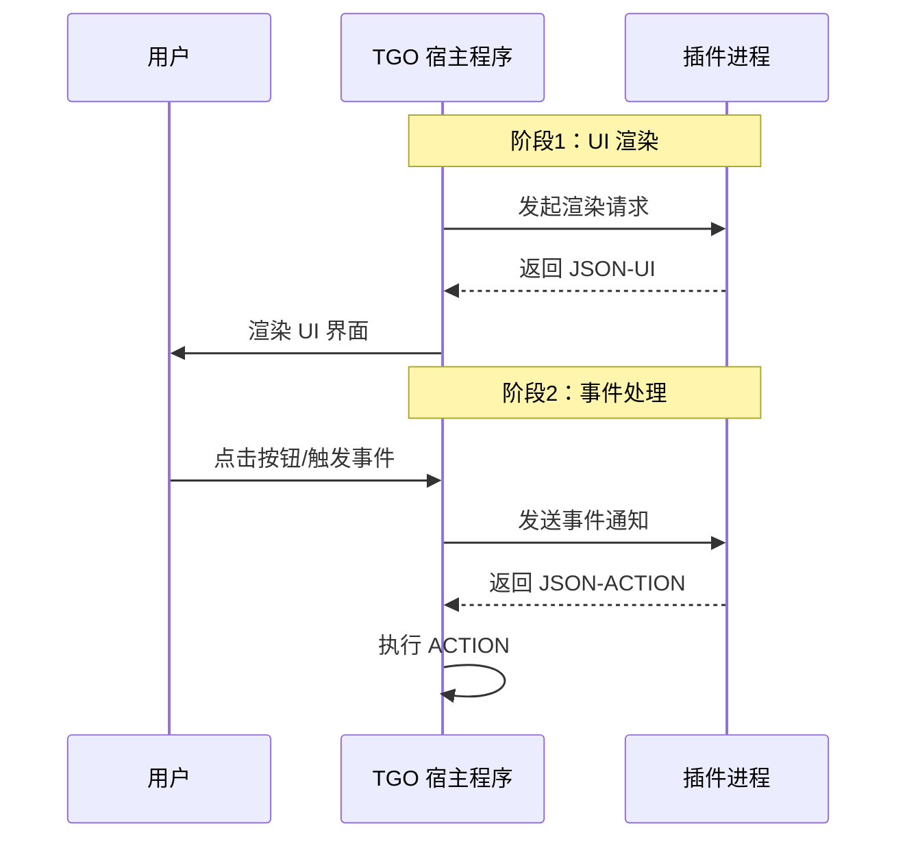
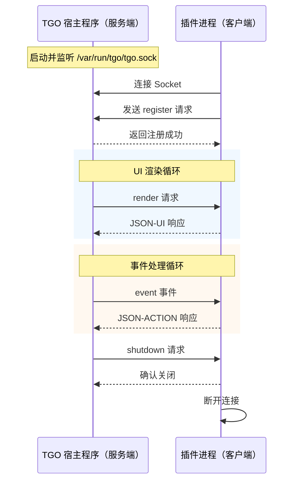

# 插件开发概述

TGO 插件系统允许开发者通过标准化的接口扩展客服系统的功能。插件可以为访客面板添加自定义信息展示、扩展聊天工具栏、集成第三方应用等。

## 什么是 TGO 插件

TGO 插件是一个独立运行的进程，通过 **Unix Socket** 与 TGO 宿主程序进行通讯。这种设计带来以下优势：

- **语言无关**：使用任何支持 Unix Socket 的编程语言开发插件
- **进程隔离**：插件崩溃不会影响主程序稳定性
- **高性能**：Unix Socket 提供低延迟的进程间通讯
- **双向通讯**：支持宿主和插件之间的双向实时通讯
- **易于部署**：无需修改主程序代码

## 插件架构

TGO 采用类似 Docker 的 **C/S 架构**：宿主程序作为服务端，插件作为客户端主动连接。

```
┌─────────────────────────────────────────────────────────────┐
│                      TGO 客服系统（服务端）                   │
│  ┌─────────────┐  ┌─────────────┐  ┌─────────────────────┐  │
│  │  访客面板   │  │  聊天工具栏  │  │   iframe 应用栏     │  │
│  └──────┬──────┘  └──────┬──────┘  └──────────┬──────────┘  │
│         │                │                    │              │
│  ┌──────┴────────────────┴────────────────────┴──────────┐  │
│  │              插件管理器（Socket 服务端）               │  │
│  │              监听: /var/run/tgo/tgo.sock               │  │
│  └────────────────────────┬──────────────────────────────┘  │
└───────────────────────────┼─────────────────────────────────┘
                            │
            ┌───────────────┼───────────────┐
            │               │               │
            ▼               ▼               ▼
      ┌───────────┐   ┌───────────┐   ┌───────────┐
      │  插件 A   │   │  插件 B   │   │  插件 C   │
      │ (Python)  │   │ (Node.js) │   │  (Go)     │
      │  客户端   │   │  客户端   │   │  客户端   │
      └───────────┘   └───────────┘   └───────────┘
```

### Socket 路径

TGO 宿主程序监听的 Unix Socket 路径：

```
/var/run/tgo/tgo.sock
```

插件启动后主动连接此 Socket，并发送 `register` 请求注册自己的能力。

## 核心概念

TGO 插件系统的交互基于两种 JSON 数据结构：

| 类型 | 说明 | 用途 |
|------|------|------|
| **JSON-UI** | UI 描述数据 | 插件返回给宿主，由宿主渲染成界面 |
| **JSON-ACTION** | 动作指令 | 插件返回给宿主，由宿主执行具体操作 |

## UI 渲染流程

插件的 UI 渲染遵循「**请求-渲染-事件-动作**」的交互模式：



### 流程详解

1. **宿主发起渲染请求**：当用户打开访客面板或触发插件时，宿主向插件发送渲染请求
2. **插件返回 JSON-UI**：插件处理请求后，返回描述 UI 结构的 JSON 数据
3. **宿主渲染界面**：宿主根据 JSON-UI 模版类型渲染对应的 UI 组件
4. **用户触发事件**：用户点击按钮或进行其他交互操作
5. **宿主发送事件**：宿主将用户操作以事件形式发送给插件
6. **插件返回 JSON-ACTION**：插件处理事件后，返回需要执行的动作
7. **宿主执行动作**：宿主根据 ACTION 类型执行相应操作（如打开链接、插入文本等）

## 完整通讯流程



## 可插点（Extension Points）

TGO 提供以下四个可插点，插件可以选择实现其中一个或多个：

| 可插点 | 标识符 | 说明 |
|--------|--------|------|
| **访客面板** | `visitor_panel` | 在聊天界面右侧的访客信息面板中添加自定义内容 |
| **聊天工具栏** | `chat_toolbar` | 在输入框上方的工具栏添加自定义按钮 |
| **iframe 应用** | `sidebar_iframe` | 在聊天界面最右侧添加 iframe 应用 |
| **第三方平台** | `channel_integration` | 接入新的消息渠道（如自定义 IM 平台） |

## 插件能力声明

插件连接到宿主后，需要主动发送 `register` 请求声明自己的能力：

```json
{
  "jsonrpc": "2.0",
  "id": 1,
  "method": "register",
  "params": {
    "name": "my-plugin",
    "version": "1.0.0",
    "description": "我的第一个 TGO 插件",
    "author": "Your Name",
    "capabilities": [
      {
        "type": "visitor_panel",
        "title": "客户订单",
        "icon": "shopping-cart"
      },
      {
        "type": "chat_toolbar",
        "title": "快捷回复",
        "icon": "message"
      }
    ]
  }
}
```

## 开发语言选择

由于插件通过 Unix Socket 通讯，你可以使用任何编程语言开发插件：

| 语言 | 适用场景 | 官方示例 |
|------|----------|----------|
| **Python** | 快速开发、数据处理、AI 集成 | ✅ 提供 |
| **Node.js** | 前端开发者、异步处理 | ✅ 提供 |
| **Go** | 高性能、低资源占用 | 社区贡献 |
| **Rust** | 极致性能、系统级插件 | 社区贡献 |

## 下一步

- [快速入门](/plugin/quickstart) - 5 分钟创建你的第一个插件
- [通讯协议](/plugin/protocol) - 了解 Unix Socket 通讯协议细节
- [可插点详解](/plugin/extension-points) - 深入了解每个可插点
- [模版规范](/plugin/templates) - JSON 模版格式说明

