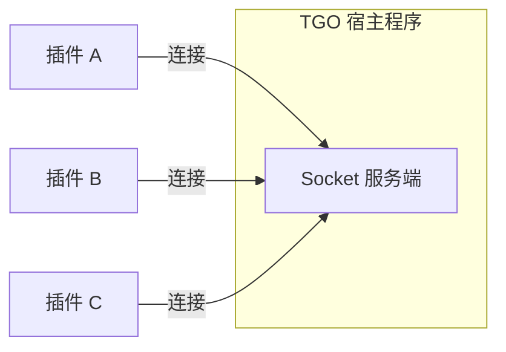
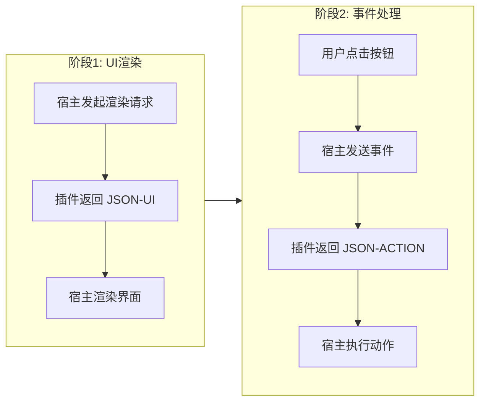
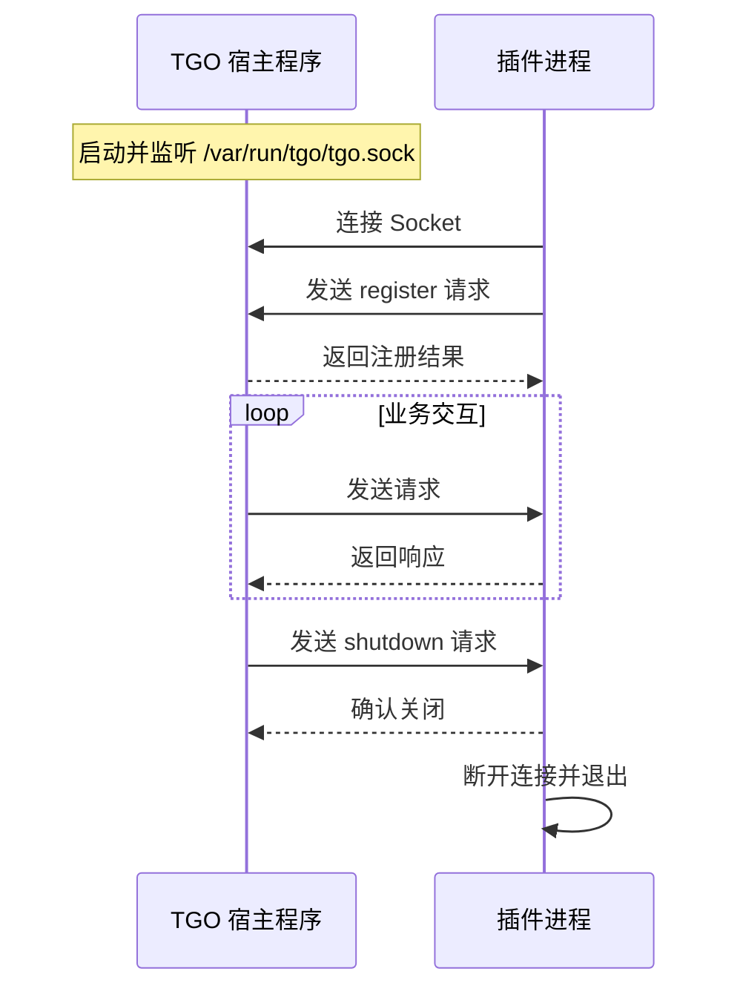

# 通讯协议规范

TGO 插件系统采用基于 **Unix Socket** 的 JSON-RPC 2.0 协议进行通讯。本文档详细说明协议规范。

## 协议概述

### 通讯架构

TGO 采用类似 Docker 的 C/S 架构：



- **TGO 宿主程序**：作为 **Socket 服务端**，监听连接
- **插件进程**：作为 **Socket 客户端**，主动连接宿主

### 通讯方式

- **Socket 类型**：Unix Domain Socket（`AF_UNIX`，`SOCK_STREAM`）
- **连接模式**：宿主作为服务端监听，插件作为客户端连接
- **通讯方向**：双向全双工通讯

### Socket 路径

TGO 宿主程序的 Socket 文件路径：

```
/var/run/tgo/tgo.sock
```

插件启动时需要：
1. 连接到宿主程序的 Socket（`/var/run/tgo/tgo.sock`）
2. 发送 `register` 请求注册插件能力
3. 等待宿主程序的请求并返回响应

### 消息格式

采用 **长度前缀 + JSON** 格式：

```
[4字节长度][JSON数据]
```

- **长度前缀**：4 字节大端序（Big-Endian）无符号整数，表示后续 JSON 数据的字节长度
- **JSON 数据**：UTF-8 编码的 JSON 字符串

示例（伪代码）：

```python
# 发送消息
def send_message(socket, data):
    json_bytes = json.dumps(data).encode('utf-8')
    length = len(json_bytes)
    socket.sendall(struct.pack('>I', length))  # 4字节大端序
    socket.sendall(json_bytes)

# 接收消息
def recv_message(socket):
    length_bytes = socket.recv(4)
    length = struct.unpack('>I', length_bytes)[0]
    json_bytes = socket.recv(length)
    return json.loads(json_bytes.decode('utf-8'))
```

## 核心交互模式

TGO 插件采用「**渲染-事件**」两阶段交互模式：



### 响应类型

插件响应分为两种类型：

| 响应类型 | 触发场景 | 用途 |
|----------|----------|------|
| **JSON-UI** | 响应 `render` 请求 | 描述需要渲染的 UI 结构 |
| **JSON-ACTION** | 响应 `event` 事件 | 指示宿主执行的操作 |

### JSON-UI 响应示例

```json
{
  "jsonrpc": "2.0",
  "id": 1,
  "result": {
    "template": "key_value",
    "data": {
      "title": "客户信息",
      "items": [
        {"label": "姓名", "value": "张三"},
        {"label": "VIP等级", "value": "黄金会员"}
      ]
    }
  }
}
```

### JSON-ACTION 响应示例

```json
{
  "jsonrpc": "2.0",
  "id": 2,
  "result": {
    "action": "open_url",
    "data": {
      "url": "https://crm.example.com/customers/12345",
      "target": "_blank"
    }
  }
}
```

## JSON-RPC 2.0 规范

### 请求格式

```json
{
  "jsonrpc": "2.0",
  "id": 1,
  "method": "method_name",
  "params": {
    "key": "value"
  }
}
```

| 字段 | 类型 | 必填 | 说明 |
|------|------|------|------|
| `jsonrpc` | string | 是 | 固定值 `"2.0"` |
| `id` | number/string | 是 | 请求唯一标识符 |
| `method` | string | 是 | 要调用的方法名 |
| `params` | object | 否 | 方法参数 |

### 成功响应

```json
{
  "jsonrpc": "2.0",
  "id": 1,
  "result": {
    "key": "value"
  }
}
```

### 错误响应

```json
{
  "jsonrpc": "2.0",
  "id": 1,
  "error": {
    "code": -32600,
    "message": "Invalid Request",
    "data": {}
  }
}
```

### 标准错误码

| 错误码 | 说明 |
|--------|------|
| `-32700` | Parse Error - JSON 解析错误 |
| `-32600` | Invalid Request - 无效的请求格式 |
| `-32601` | Method Not Found - 方法不存在 |
| `-32602` | Invalid Params - 参数错误 |
| `-32603` | Internal Error - 内部错误 |
| `-32000` ~ `-32099` | 服务器自定义错误 |

## 生命周期方法

### 连接流程



### register

插件连接后，**主动发送**注册请求，向宿主程序声明自己的能力。

**请求（插件 → 宿主）：**

```json
{
  "jsonrpc": "2.0",
  "id": 1,
  "method": "register",
  "params": {
    "name": "my-plugin",
    "version": "1.0.0",
    "description": "插件描述",
    "author": "作者名",
    "homepage": "https://github.com/...",
    "capabilities": [
      {
        "type": "visitor_panel",
        "title": "客户订单",
        "icon": "shopping-cart",
        "priority": 10
      }
    ]
  }
}
```

**响应（宿主 → 插件）：**

```json
{
  "jsonrpc": "2.0",
  "id": 1,
  "result": {
    "success": true,
    "plugin_id": "plugin_abc123",
    "host_version": "1.0.0"
  }
}
```

**能力声明字段：**

| 字段 | 类型 | 必填 | 说明 |
|------|------|------|------|
| `type` | string | 是 | 可插点类型 |
| `title` | string | 是 | 显示标题 |
| `icon` | string | 否 | 图标名称（使用 Lucide 图标库） |
| `priority` | number | 否 | 显示优先级，数值越小越靠前 |

### shutdown

宿主程序请求插件优雅关闭。

**请求（宿主 → 插件）：**

```json
{
  "jsonrpc": "2.0",
  "id": 999,
  "method": "shutdown"
}
```

**响应（插件 → 宿主）：**

```json
{
  "jsonrpc": "2.0",
  "id": 999,
  "result": {
    "success": true
  }
}
```

插件应在发送响应后退出进程。

### ping

心跳检测，用于确认插件进程存活。

**请求：**

```json
{
  "jsonrpc": "2.0",
  "id": 100,
  "method": "ping"
}
```

**响应：**

```json
{
  "jsonrpc": "2.0",
  "id": 100,
  "result": {
    "pong": true,
    "timestamp": 1703664000000
  }
}
```

## 业务方法

业务方法分为两类：
- **渲染方法**（`*/render`）：返回 JSON-UI，用于渲染界面
- **事件方法**（`*/event`）：返回 JSON-ACTION，用于执行操作

---

### visitor_panel/render

渲染访客面板内容。返回 **JSON-UI**。

**请求：**

```json
{
  "jsonrpc": "2.0",
  "id": 2,
  "method": "visitor_panel/render",
  "params": {
    "visitor_id": "v_abc123",
    "session_id": "s_xyz789",
    "visitor": {
      "name": "张三",
      "email": "zhangsan@example.com",
      "phone": "138****1234",
      "metadata": {
        "user_id": "u_12345",
        "vip_level": 3
      }
    },
    "context": {
      "current_page": "https://example.com/products/123",
      "referrer": "https://google.com"
    }
  }
}
```

**响应（JSON-UI）：**

```json
{
  "jsonrpc": "2.0",
  "id": 2,
  "result": {
    "template": "key_value",
    "data": {
      "title": "客户信息",
      "items": [
        {"label": "VIP等级", "value": "黄金会员"},
        {"label": "累计消费", "value": "¥12,580"}
      ]
    }
  }
}
```

---

### visitor_panel/event

处理访客面板中的用户交互事件（如按钮点击）。返回 **JSON-ACTION**。

**请求：**

```json
{
  "jsonrpc": "2.0",
  "id": 3,
  "method": "visitor_panel/event",
  "params": {
    "event_type": "button_click",
    "action_id": "view_in_crm",
    "visitor_id": "v_abc123",
    "session_id": "s_xyz789",
    "payload": {}
  }
}
```

**响应（JSON-ACTION）：**

```json
{
  "jsonrpc": "2.0",
  "id": 3,
  "result": {
    "action": "open_url",
    "data": {
      "url": "https://crm.example.com/customers/v_abc123",
      "target": "_blank"
    }
  }
}
```

---

### chat_toolbar/render

渲染聊天工具栏按钮点击后的内容。返回 **JSON-UI**。

**请求：**

```json
{
  "jsonrpc": "2.0",
  "id": 4,
  "method": "chat_toolbar/render",
  "params": {
    "action_id": "quick_reply",
    "session_id": "s_xyz789",
    "visitor_id": "v_abc123",
    "agent_id": "a_agent01",
    "context": {
      "last_message": "请问发货时间是多久？",
      "input_text": ""
    }
  }
}
```

**响应（JSON-UI - 显示列表选择）：**

```json
{
  "jsonrpc": "2.0",
  "id": 4,
  "result": {
    "template": "list",
    "data": {
      "title": "快捷回复",
      "searchable": true,
      "items": [
        {"id": "r1", "text": "感谢您的咨询，请问有什么可以帮您？"},
        {"id": "r2", "text": "订单一般3-5个工作日发货"},
        {"id": "r3", "text": "如有问题可随时联系我们"}
      ]
    }
  }
}
```

---

### chat_toolbar/event

处理聊天工具栏中的用户交互事件。返回 **JSON-ACTION**。

**请求：**

```json
{
  "jsonrpc": "2.0",
  "id": 5,
  "method": "chat_toolbar/event",
  "params": {
    "event_type": "item_select",
    "action_id": "quick_reply",
    "selected_id": "r2",
    "session_id": "s_xyz789",
    "visitor_id": "v_abc123"
  }
}
```

**响应（JSON-ACTION - 插入文本）：**

```json
{
  "jsonrpc": "2.0",
  "id": 5,
  "result": {
    "action": "insert_text",
    "data": {
      "text": "订单一般3-5个工作日发货",
      "replace": false
    }
  }
}
```

### sidebar_iframe/config

获取 iframe 应用配置。

**请求：**

```json
{
  "jsonrpc": "2.0",
  "id": 4,
  "method": "sidebar_iframe/config"
}
```

**响应：**

```json
{
  "jsonrpc": "2.0",
  "id": 4,
  "result": {
    "url": "https://your-app.example.com/tgo-plugin",
    "title": "CRM 系统",
    "icon": "users",
    "width": 400,
    "allow_fullscreen": true
  }
}
```

### channel_integration/manifest

获取第三方平台集成配置。

**请求：**

```json
{
  "jsonrpc": "2.0",
  "id": 5,
  "method": "channel_integration/manifest"
}
```

**响应：**

```json
{
  "jsonrpc": "2.0",
  "id": 5,
  "result": {
    "channel_type": "custom_im",
    "name": "自定义IM平台",
    "icon": "message-circle",
    "config_schema": {
      "type": "object",
      "properties": {
        "api_key": {
          "type": "string",
          "title": "API Key",
          "description": "平台 API 密钥"
        },
        "webhook_secret": {
          "type": "string",
          "title": "Webhook Secret",
          "format": "password"
        }
      },
      "required": ["api_key"]
    },
    "setup_guide": "# 接入指南\n\n1. 登录平台后台...\n2. 创建应用...",
    "webhook_endpoint": "/api/webhooks/custom-im"
  }
}
```

## JSON-ACTION 类型参考

当处理用户交互事件时，插件返回 JSON-ACTION 指示宿主执行操作。

### 支持的 ACTION 类型

| action | 说明 | 适用场景 |
|--------|------|----------|
| `open_url` | 打开 URL 链接 | 跳转到外部系统 |
| `insert_text` | 在输入框插入文本 | 快捷回复、模板插入 |
| `send_message` | 直接发送消息 | 自动回复 |
| `show_toast` | 显示提示消息 | 操作反馈 |
| `copy_text` | 复制文本到剪贴板 | 复制订单号等 |
| `refresh` | 刷新当前插件 UI | 数据更新后刷新 |
| `close_modal` | 关闭弹窗 | 取消操作 |
| `noop` | 无操作 | 仅记录，不执行 |

### ACTION 详细说明

#### open_url

打开 URL 链接。

```json
{
  "action": "open_url",
  "data": {
    "url": "https://crm.example.com/customers/12345",
    "target": "_blank"
  }
}
```

| 字段 | 类型 | 必填 | 说明 |
|------|------|------|------|
| `url` | string | 是 | 要打开的 URL |
| `target` | string | 否 | `_blank`（新标签页）或 `_self`（当前页） |

#### insert_text

在客服输入框中插入文本。

```json
{
  "action": "insert_text",
  "data": {
    "text": "您好，订单一般3-5个工作日发货。",
    "replace": false
  }
}
```

| 字段 | 类型 | 必填 | 说明 |
|------|------|------|------|
| `text` | string | 是 | 要插入的文本内容 |
| `replace` | boolean | 否 | 是否替换现有内容，默认 `false` 追加 |

#### send_message

直接发送消息给访客。

```json
{
  "action": "send_message",
  "data": {
    "content": "感谢您的咨询！",
    "content_type": "text"
  }
}
```

| 字段 | 类型 | 必填 | 说明 |
|------|------|------|------|
| `content` | string | 是 | 消息内容 |
| `content_type` | string | 否 | 消息类型：`text` / `markdown` |

#### show_toast

显示提示消息。

```json
{
  "action": "show_toast",
  "data": {
    "message": "操作成功！",
    "type": "success",
    "duration": 3000
  }
}
```

| 字段 | 类型 | 必填 | 说明 |
|------|------|------|------|
| `message` | string | 是 | 提示内容 |
| `type` | string | 否 | 类型：`success` / `error` / `warning` / `info` |
| `duration` | number | 否 | 显示时长（毫秒），默认 3000 |

#### copy_text

复制文本到剪贴板。

```json
{
  "action": "copy_text",
  "data": {
    "text": "ORD-2024001234",
    "toast": "订单号已复制"
  }
}
```

| 字段 | 类型 | 必填 | 说明 |
|------|------|------|------|
| `text` | string | 是 | 要复制的文本 |
| `toast` | string | 否 | 复制成功后的提示文本 |

#### refresh

刷新当前插件的 UI，重新触发 render 请求。

```json
{
  "action": "refresh",
  "data": {}
}
```

#### close_modal

关闭当前显示的弹窗。

```json
{
  "action": "close_modal",
  "data": {}
}
```

#### noop

无操作，用于仅记录用户行为但不执行任何动作。

```json
{
  "action": "noop",
  "data": {
    "log": "用户点击了取消按钮"
  }
}
```

---

## 错误处理最佳实践

### 1. 超时处理

宿主程序对每个请求设有默认超时（30秒），插件应确保及时响应。

### 2. 优雅降级

当插件无法获取数据时，应返回友好的错误信息：

```json
{
  "jsonrpc": "2.0",
  "id": 2,
  "result": {
    "template": "text",
    "data": {
      "text": "暂时无法获取订单信息",
      "type": "warning"
    }
  }
}
```

### 3. 业务错误码

建议使用 `-32000` 到 `-32099` 范围的错误码：

| 错误码 | 说明 |
|--------|------|
| `-32000` | 服务暂不可用 |
| `-32001` | 认证失败 |
| `-32002` | 权限不足 |
| `-32003` | 资源不存在 |
| `-32004` | 请求频率限制 |

## 编码要求

### 字符编码

所有消息必须使用 **UTF-8** 编码。

### 换行符

消息必须以 `\n`（LF）结尾，不支持 `\r\n`（CRLF）。

### JSON 格式

- 不允许有尾随逗号
- 不允许有注释
- 字符串使用双引号

## 下一步

- [可插点详解](/plugin/extension-points) - 了解每个可插点的具体用法
- [模版规范](/plugin/templates) - 学习如何定义 UI 模版
- [完整示例](/plugin/examples) - 查看完整的插件实现

